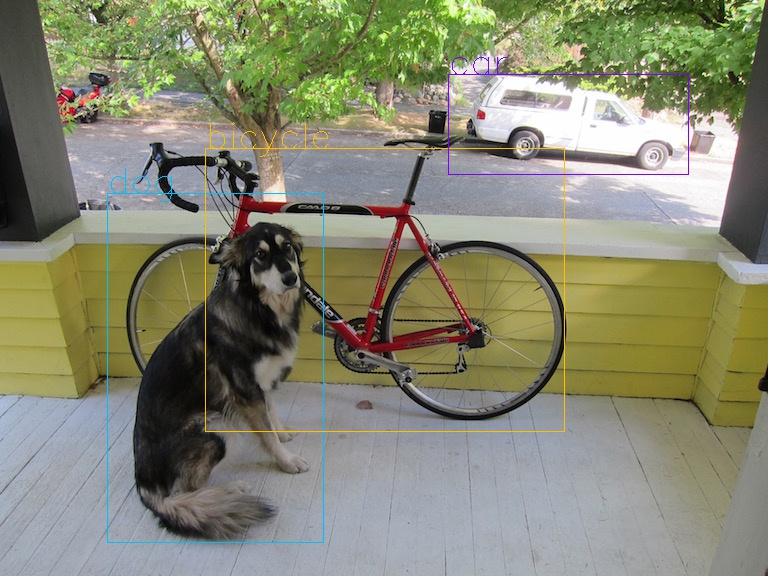

# YOLOV2-pytorch

[]()[]()

This project references [marvis's](https://github.com/marvis/pytorch-yolo2) project

This repository supports:

- both Windows and Linux
- both GPU and CPU
- both OpenCV 3.x and OpenCV 2.4.13
- both cuDNN 6 and cuDNN 7
- CUDA >= 7.5

##### Requires:

- **Linux GCC>=4.9 or Windows MS Visual Studio 2015 (v140)**: <https://go.microsoft.com/fwlink/?LinkId=532606&clcid=0x409> (or offline [ISO image](https://go.microsoft.com/fwlink/?LinkId=615448&clcid=0x409))

- **CUDA 8.0**: <https://developer.nvidia.com/cuda-downloads>

- **OpenCV 3.x**: <https://sourceforge.net/projects/opencvlibrary/files/opencv-win/3.2.0/opencv-3.2.0-vc14.exe/download>

- **or OpenCV 2.4.13**:https://sourceforge.net/projects/opencvlibrary/files/opencv-win/2.4.13/opencv-2.4.13.2-vc14.exe/download

- **GPU with CC >= 2.0** if you use CUDA, or **GPU CC >= 3.0** if you use cuDNN + CUDA: <https://en.wikipedia.org/wiki/CUDA#GPUs_supported>

- This project uses **Python 3**. To install the dependent libraries, type the following command in a terminal.

  ```shell
  sudo pip3 install -r requirements.txt
  ```

  or(On Windows)

  ```shell
  pip install -r requirements.txt
  ```

##### Pre-trained models for different cfg-files can be downloaded from (smaller -> faster & lower quality):

- `yolo.cfg` (194 MB COCO-model) - require 4 GB GPU-RAM: <http://pjreddie.com/media/files/yolo.weights>
- `yolo-voc.cfg` (194 MB VOC-model) - require 4 GB GPU-RAM: <http://pjreddie.com/media/files/yolo-voc.weights>
- `tiny-yolo.cfg` (60 MB COCO-model) - require 1 GB GPU-RAM: <http://pjreddie.com/media/files/tiny-yolo.weights>
- `tiny-yolo-voc.cfg` (60 MB VOC-model) - require 1 GB GPU-RAM: <http://pjreddie.com/media/files/tiny-yolo-voc.weights>
- `yolo9000.cfg` (186 MB Yolo9000-model) - require 4 GB GPU-RAM: <http://pjreddie.com/media/files/yolo9000.weights>

Put it near:`YOLOV2-pytorch/data/weights/`

You can get cfg-files by path: `YOLOV2-pytorch/cfg/`

How to use
---

#### On windows

1. Run `YOLOV2-pytorch/detect.bat`(This is a demo for test)
2. You can find result picture in `YOLOV2-pytorch/data/out/predictions.jpg`.Look like this



#### On linux

1. Run `YOLOV2-pytorch/detect.sh`(This is a demo for test)

2. You can find result picture in `YOLOV2-pytorch/data/out/predictions.jpg`. the same as the picture on windows

Training YOLO on VOC
---

####On windows

1. Download pre-trained weights for the convolutional layers (76 MB): <http://pjreddie.com/media/files/darknet19_448.conv.23> and put to the directory `YOLOV2-pytorch/data/weights/`

2. Download The Pascal VOC Data and unpack it to directory `YOLOV2-pytorch/data/voc/` will be created dir `YOLOV2-pytorch/data/voc/VOCdevkit/`:

   - <http://pjreddie.com/media/files/VOCtrainval_11-May-2012.tar>
   - <http://pjreddie.com/media/files/VOCtrainval_06-Nov-2007.tar>
   - <http://pjreddie.com/media/files/VOCtest_06-Nov-2007.tar>

   2.1 Download file `voc_label.py` to dir `YOLOV2-pytorch/data/voc/`: <http://pjreddie.com/media/files/voc_label.py>

3. Download and install Python for Windows: <https://www.python.org/ftp/python/3.5.2/python-3.5.2-amd64.exe>

4. Run `YOLOV2-pytorch/data/voc/voc_label.bat` (to generate files: 2007_test.txt, 2007_train.txt, 2007_val.txt, 2012_train.txt, 2012_val.txt)

5. Run `YOLOV2-pytorch/data/voc/generate_train.bat`

6. Set `batch=64` and `subdivisions=8` in the file `YOLOV2-pytorch/cfg/yolo-voc.cfg`

7. Start training by using `YOLOV2-pytorch/train.bat` or by using the command line: `python cvs.py --train --True --config cfg/yolo-voc.cfg --binary data/weights/darknet19_448.conv.23 --trainlist data/voc/train.txt -- testlist data/voc/2007_test.txt`(default with GPU if you want to use cpu to train ,you can use it`--gpu False`)

#### On linux

1. Download pre-trained weights for the convolutional layers (76 MB): <http://pjreddie.com/media/files/darknet19_448.conv.23> and put to the directory `YOLOV2-pytorch/data/weights/`

2. Download The Pascal VOC Data and unpack it to directory `YOLOV2-pytorch/data/voc/` will be created dir `YOLOV2-pytorch/data/voc/VOCdevkit/`:

   - <http://pjreddie.com/media/files/VOCtrainval_11-May-2012.tar>
   - <http://pjreddie.com/media/files/VOCtrainval_06-Nov-2007.tar>
   - <http://pjreddie.com/media/files/VOCtest_06-Nov-2007.tar>

   2.1 Download file `voc_label.py` to dir `YOLOV2-pytorch/data/voc/`: <http://pjreddie.com/media/files/voc_label.py>

3. Run `YOLOV2-pytorch/data/voc/voc_label.sh` (to generate files: 2007_test.txt, 2007_train.txt, 2007_val.txt, 2012_train.txt, 2012_val.txt)

4. Run `YOLOV2-pytorch/data/voc/generate_train.sh`

5. Set `batch=64` and `subdivisions=8` in the file `YOLOV2-pytorch/cfg/yolo-voc.cfg`

6. Start training by using `YOLOV2-pytorch/train.sh` or by using the command line: `python cvs.py --train True --config cfg/yolo-voc.cfg --binary data/weights/darknet19_448.conv.23 --trainlist data/voc/train.txt -- testlist data/voc/2007_test.txt`(default with GPU if you want to use cpu to train ,you can use it`--gpu False`)


# Evaluate The Model

#### On windows

1. Using the command line: `python cvs.py --eval True`
2. Run `YOLOV2-pytorch/eval.bat`

#### On linux

Using the command line: `python cvs.py --eval True`

License
---

This project is released as the open source software with the GNU Lesser General Public License version 3 (LGPL v3).